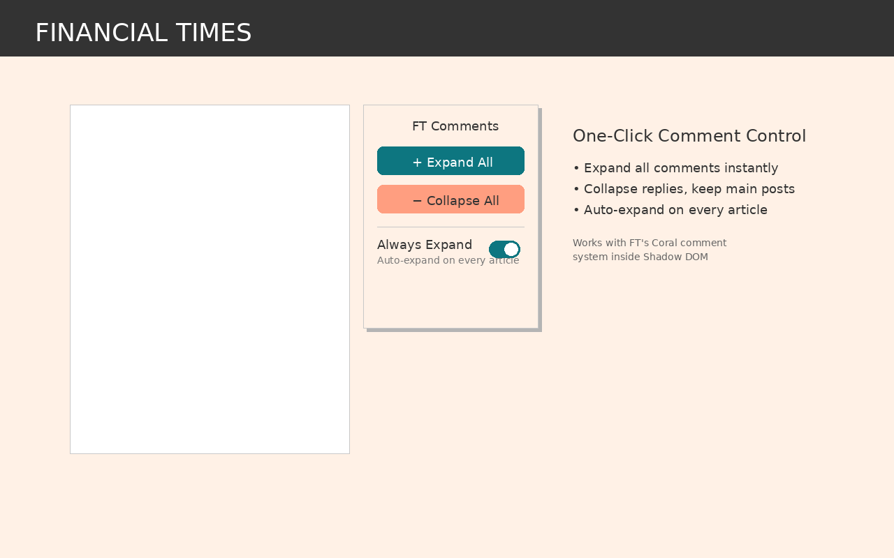
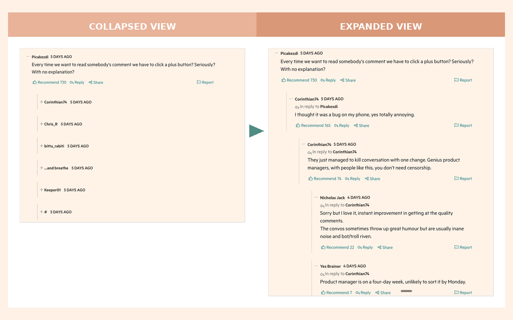

# FT Expand All Comments

A Chrome extension that brings back the classic Financial Times comment experience — expand or collapse all comments with one click.


## ✨ Features

- **Expand All** — Instantly expand every comment and reply with one click
- **Collapse All** — Collapse replies while keeping top-level comments visible
- **Always Expand** — Toggle on to auto-expand comments on every FT article you visit

## 📸 Screenshots

<p align="center">
  
</p>

<p align="center">
  
</p>

## 🚀 Installation

### From Chrome Web Store (Recommended)
*Coming soon — pending review*

### Manual Installation (Developer Mode)

#### Step 1: Download the extension

1. Go to this page: https://github.com/leathalobaidi/ft-expand-comments
2. Click the green **Code** button (near the top right)
3. Click **Download ZIP** from the dropdown menu
4. The file `ft-expand-comments-main.zip` will download to your Downloads folder
5. **Unzip the file** — double-click it on Mac, or right-click → Extract All on Windows

You'll now have a folder called `ft-expand-comments-main` containing:
```
ft-expand-comments-main/
├── extension/        ← This is what you need!
├── screenshots/
├── README.md
└── LICENSE
```

#### Step 2: Install in Chrome

1. Open Chrome and type `chrome://extensions/` in the address bar
2. Turn on **Developer mode** (toggle in the top-right corner)
3. Click **Load unpacked** (button appears after enabling Developer mode)
4. Navigate to the `ft-expand-comments-main` folder you unzipped
5. Select the **`extension`** folder inside it (not the main folder!)
6. Click **Select Folder**

Done! You'll see the FT icon in your Chrome toolbar.

## 🛠️ How It Works

The extension interacts with FT's Coral Talk comment widget, which renders inside a Shadow DOM. It:

1. Waits for the comment widget to load
2. Finds comment toggle buttons by their `aria-label` attributes
3. Uses the `coral-indent-N` class to distinguish top-level comments from replies
4. Provides manual expand/collapse controls via the popup
5. Optionally auto-expands comments using a MutationObserver

## 🔒 Privacy

This extension:
- ✅ Does NOT collect any personal data
- ✅ Does NOT track your browsing
- ✅ Does NOT send data to external servers
- ✅ Only stores your "Always Expand" preference locally

[Full Privacy Policy](https://gist.githubusercontent.com/leathalobaidi/65d0b4cc14bb236015dbe6296886b3b4/raw/privacy-policy.html)

## 📁 Project Structure

```
extension/
├── manifest.json      # Extension configuration (Manifest V3)
├── content.js         # Runs on FT pages, handles comment expansion
├── popup.html         # Extension popup UI
├── popup.js           # Popup button handlers
├── icon16.png         # Extension icons
├── icon48.png
└── icon128.png
```

## 🤖 Vibe Coded

This extension was built in one evening using **Claude AI** (Anthropic) as a coding assistant. The entire development process — from initial concept to Chrome Web Store submission — was completed through conversational AI pair programming.

### The Journey
1. Identified the problem: FT's new comment system collapses all replies by default
2. Explored the DOM structure using browser dev tools
3. Discovered comments live inside a Shadow DOM (`coral-shadow-container`)
4. Found the `coral-indent-N` class pattern for nesting levels
5. Built the extension iteratively, fixing bugs as they appeared
6. Added "Always Expand" feature for the classic FT experience
7. Created all assets and submitted to Chrome Web Store

## 🤝 Contributing

Found a bug or have a feature request? Open an issue!

## 📄 License

MIT License — feel free to use, modify, and distribute.

---

Made with ☕ and Claude AI
